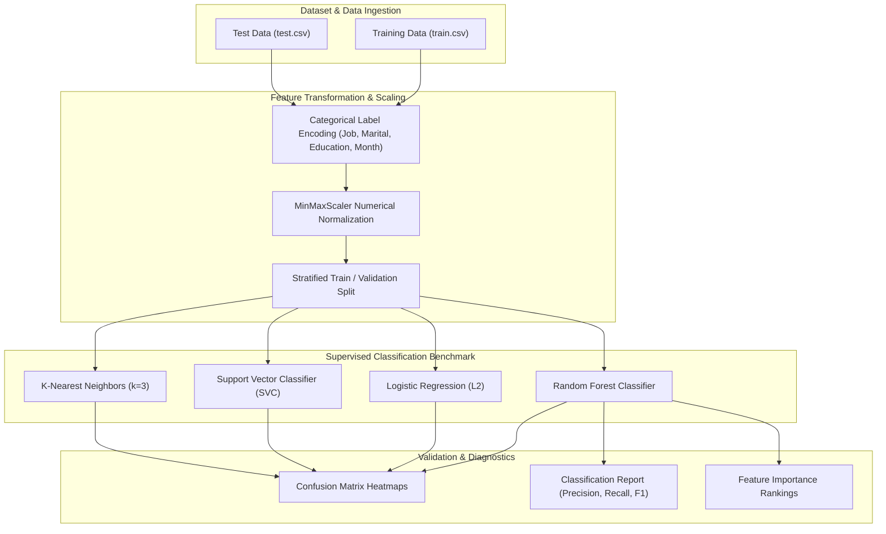

<br/><br/>

<!-- Animated Title -->
<p align="center">
  <a href="#">
    
  </a>
</p>

<p align="center">
  <b>Predictive Machine Learning Engine for Retail Banking Term Deposit Subscription Conversion</b><br/>
  <i>Direct Telemarketing Analytics · Multi-Model Benchmarking (Random Forest, SVM, KNN, Logistic Regression) · Comprehensive Client Profiling · MinMax Feature Scaling</i>
</p>

<br/>

<!-- Badges Row 1: Core Technologies -->
<p align="center">
  
  
  
  
  
</p>

<!-- Badges Row 2: Analytics & Status -->
<p align="center">
  
  
  
  
</p>

<br/>

<!-- Quick Navigation Bar -->
<p align="center">
  <a href="#-overview"></a>
  &nbsp;
  <a href="#-problem-statement--marketing-solution"></a>
  &nbsp;
  <a href="#-benchmarked-models"></a>
  &nbsp;
  <a href="#%EF%B8%8F-analytical-architecture"></a>
  &nbsp;
  <a href="#-feature-engineering--pipeline"></a>
  &nbsp;
  <a href="#-quickstart--execution"></a>
</p>

---

## 📌 Overview

**Bank Term Deposit Prediction** is a machine learning study designed to optimize retail banking direct marketing campaigns. Telemarketing campaigns often suffer from low conversion rates ($<12\%$), incurring heavy personnel costs and customer contact fatigue.

By analyzing extensive client demographic, economic, and prior outreach data from the benchmark **Bank Marketing Dataset**, this platform benchmarks four supervised classification algorithms (**Random Forest**, **Logistic Regression**, **Support Vector Machines (SVC)**, and **K-Nearest Neighbors**). The model identifies high-propensity leads, allowing call centers to prioritize high-yield contacts and double direct marketing return on investment (ROI).

```
                      ┌────────────────────────────────────────────────────────┐
                      │             Bank Marketing Engine                      │
                      │                                                        │
[ Client Profile &   ]┼──> [ Label Encoding & MinMaxScaler ]                   ├──> [ Conversion Propensity ]
[ Campaign History   ]│             │                                          │    - Subscription Verdict (Y/N)
                      │             ▼                                          │    - Probability Score
                      │    [ Multi-Model Benchmark Arena ]                     │    - Feature Importance Ranks
                      │       ├── Random Forest (Ensemble)                     │    - Confusion Matrix Audit
                      │       ├── Support Vector Classifier (SVC)              │
                      │       ├── K-Nearest Neighbors (KNN)                    │
                      │       └── Logistic Regression (L2)                     │
                      └────────────────────────────────────────────────────────┘
```

---

## 🎯 Problem Statement & Marketing Solution

<table>
<tr>
<td width="50%" valign="top">

### ❌ The Telemarketing Efficiency Gap

Direct outreach in retail banking faces systematic hurdles:

- 📞 **Cold Call Fatigue**: Calling unfiltered prospect lists wastes thousands of banker hours on uninterested clients.
- 📉 **Low Baseline Conversion**: Across tens of thousands of calls, subscription rates rarely exceed 10–12%.
- ⏱️ **Contact Duration Bias**: While call duration strongly correlates with conversion, it cannot be known prior to placing the call.
- 🧩 **Multi-Channel Noise**: Blending cellular vs. telephone contacts across varying macroeconomic months skews predictions.

</td>
<td width="50%" valign="top">

### ✅ The Machine Learning Solution

| Challenge | Applied Engineering Solution |
| :--- | :--- |
| **Targeted Lead Prioritization** | Scores clients by probability of subscription, enabling tier-1 call lists. |
| **Multi-Model Evaluation** | Benchmarks **Random Forest**, **Logistic Regression**, **SVC**, and **KNN** on precision and recall. |
| **Normalized Feature Scaling** | **MinMaxScaler** normalizes age, balance, duration, and campaign touches into unified numeric ranges. |
| **Actionable Demographic Profiling** | Identifies optimal age brackets, job sectors (retirees, students), and housing loan thresholds. |

</td>
</tr>
</table>

---

## 🔥 Benchmarked Models

<table>
<tr>
<td width="25%" align="center" valign="top">

### 🌲 Random Forest
<br/>
<b>Top Performing Ensemble</b>
<p align="left">
• High non-linear split tolerance<br/>
• Native feature importance ranking<br/>
• Robust to correlated financial features<br/>
• Low variance across validation folds
</p>

</td>
<td width="25%" align="center" valign="top">

### 📈 Logistic Regression
<br/>
<b>Calibrated Baseline</b>
<p align="left">
• Fast probabilistic odds ratio output<br/>
• High interpretability for compliance<br/>
• Scaled with L2 penalty (max_iter=5000)<br/>
• Ideal for real-time scoring rules
</p>

</td>
<td width="25%" align="center" valign="top">

### ⚡ Support Vector (SVC)
<br/>
<b>Maximal Margin Separation</b>
<p align="left">
• Non-linear RBF kernel projection<br/>
• Effective in high-dimensional spaces<br/>
• Robust to outlier customer balances<br/>
• Clear decision boundary margins
</p>

</td>
<td width="25%" align="center" valign="top">

### 🎯 KNN (k=3)
<br/>
<b>Instance-Based Learning</b>
<p align="left">
• Euclidean neighbor similarity<br/>
• Grouping similar financial profiles<br/>
• Non-parametric classification<br/>
• Intuitive neighborhood voting
</p>

</td>
</tr>
</table>

---

## 🏗️ Analytical Architecture



---

## 🔬 Feature Engineering & Pipeline

### Input Features Overview
1. **Client Demographics**: `age`, `job` (management, technician, blue-collar, etc.), `marital`, `education`.
2. **Financial Standing**: `default` (credit default flag), `balance` (yearly average in euros), `housing` (housing loan), `loan` (personal loan).
3. **Current Campaign Contact**: `contact` (cellular, telephone), `day`, `month`, `duration` (last contact duration).
4. **Previous Campaign History**: `campaign` (number of contacts during current campaign), `pdays` (days passed since last campaign), `previous`, `poutcome` (outcome of previous marketing campaign).
5. **Target**: `y` (Binary: `yes` = Subscribed, `no` = Did not subscribe).

---

## ⚙️ Technical Stack

| Component | Technology | Purpose & Implementation |
| :--- | :--- | :--- |
| **Language** | **Python 3.10+** | Core analytical and ML programming |
| **Modeling & Preprocessing** | **Scikit-Learn** | RandomForest, SVC, KNN, LogisticRegression, MinMaxScaler, LabelEncoder |
| **Data Structures** | **Pandas & NumPy** | Dataframe wrangling, missing value inspection, array operations |
| **Visual Analytics** | **Seaborn & Matplotlib** | Correlation heatmaps, distribution plots, and confusion matrices |
| **Runtime Environment** | **Jupyter Notebook** | Interactive 120-cell experimental notebook |

---

## 📁 Repository Structure

```
Bank-Term-Deposit-Prediction-/
├── 📄 bank-term-deposit-prediction1928e8bbb6 (1).ipynb # Comprehensive 120-cell analysis & modeling notebook
├── 📊 train.csv                                        # Training dataset with ground truth labels
├── 📊 test.csv                                         # Out-of-sample evaluation dataset
└── 📄 README.md                                        # Documentation
```

---

## 🚀 Quickstart & Execution

### Prerequisites
- **Python**: 3.10 or higher
- **Jupyter Notebook / JupyterLab**: Recommended

---

### 1. Installation

```bash
# 1. Clone repository
git clone https://github.com/IbrahimAbdelsattar/Bank-Term-Deposit-Prediction-.git
cd Bank-Term-Deposit-Prediction-

# 2. Create virtual environment
python -m venv venv
source venv/bin/activate        # On Windows: .\venv\Scripts\activate

# 3. Install required packages
pip install numpy pandas scikit-learn seaborn matplotlib jupyter
```

---

### 2. Running the Analysis

```bash
jupyter notebook "bank-term-deposit-prediction1928e8bbb6 (1).ipynb"
```

*Execute the notebook cells sequentially to reproduce feature scaling, model benchmarking, confusion matrices, and conversion insights.*

---

## 👥 Author & Connect

**Ibrahim Abdelsattar**  
*AI Engineer & Machine Learning Specialist*

- 🌐 **GitHub**: [@IbrahimAbdelsattar](https://github.com/IbrahimAbdelsattar)
- 💼 **LinkedIn**: [Ibrahim Abdelsattar](https://www.linkedin.com/in/ibrahim-abdelsattar/)
- 📧 **Email**: [ibrahimabdelsattar042@gmail.com](mailto:ibrahimabdelsattar042@gmail.com)

---

<p align="center">
  <sub>Engineered for financial machine learning, marketing optimization, and propensity analytics. © 2026 Bank Term Deposit Prediction.</sub>
</p>
