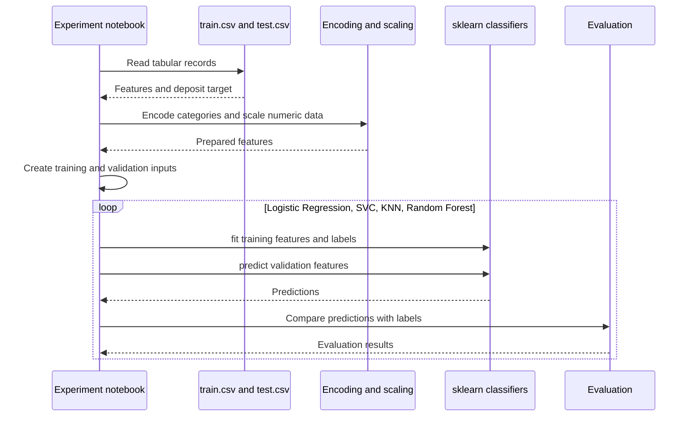

# Bank Term Deposit Prediction

A banking marketing analysis notebook that compares classifiers for predicting whether a customer subscribes to a term deposit.

**Technology:** Python · pandas · scikit-learn · Matplotlib · Seaborn

## Features

- Explore client attributes and campaign variables.
- Encode categorical features and apply MinMax scaling.
- Compare Logistic Regression, SVC, K-Nearest Neighbors, and Random Forest.

## Repository guide

| Path | Purpose |
|---|---|
| [bank-term-deposit-prediction1928e8bbb6 (1).ipynb](bank-term-deposit-prediction1928e8bbb6%20%281%29.ipynb) | End-to-end exploration and classification. |
| [train.csv](train.csv) | Training dataset. |
| [test.csv](test.csv) | Additional dataset. |

## Requirements and current limitations

The notebook reads Kaggle paths under `/kaggle/input/data-of-customers/`. Point these reads to the included `train.csv` and `test.csv` when running locally. Review the role of each split before interpreting evaluation results; a notebook run is not an independent validation of deployment performance.

No separate web application or committed inference service is included.

## UML diagrams

### Main workflow

The notebook prepares tabular data, compares several scikit-learn classifiers, and inspects their predictions.



## Getting started

```bash
git clone https://github.com/IbrahimAbdelsattar/Bank-Term-Deposit-Prediction-.git
cd Bank-Term-Deposit-Prediction-
```

Use a Python virtual environment:

```bash
python -m venv .venv
```

Activate it with `source .venv/bin/activate` on macOS/Linux or `.venv\Scripts\Activate.ps1` in PowerShell.

```bash
python -m pip install jupyter pandas numpy matplotlib seaborn scikit-learn
python -m jupyter notebook
```

Open the notebook listed above and run its cells in order. Adjust dataset and model paths as described in the limitations section.
